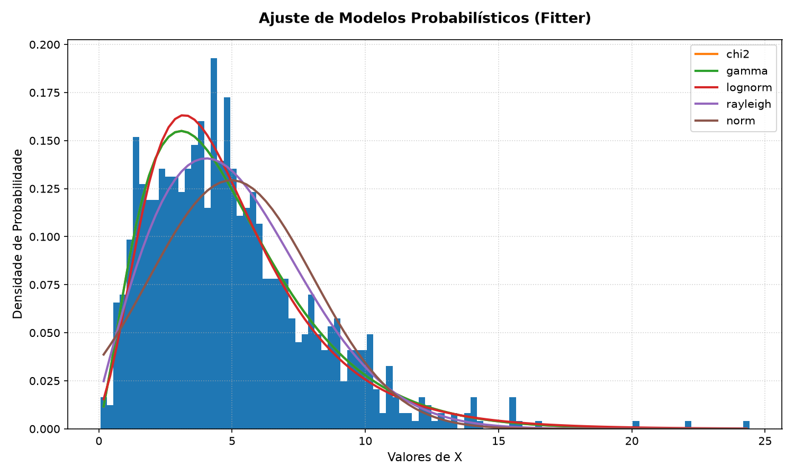
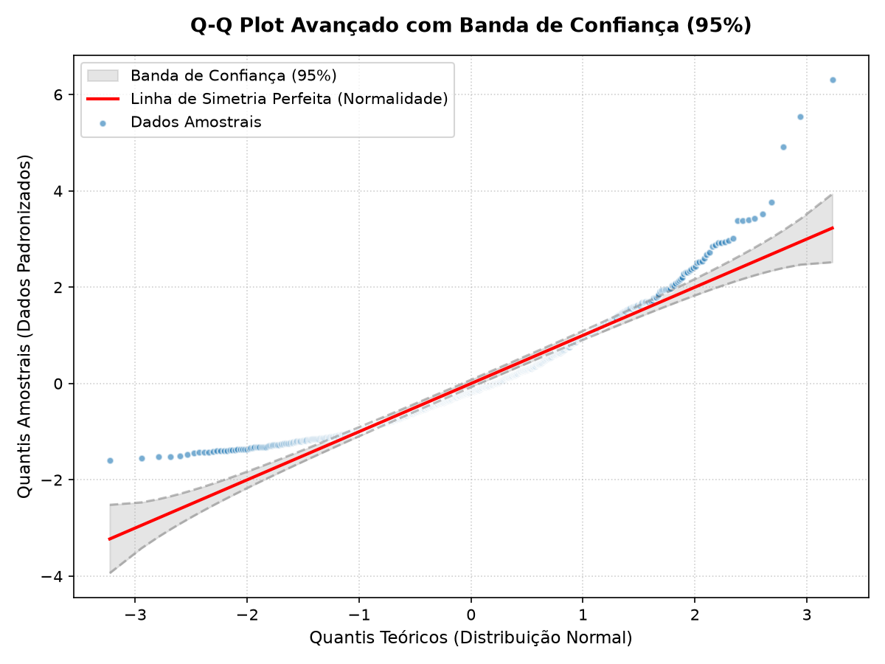

# RELATÓRIO UNIFICADO: TRABALHOS 1, 2 E 3
**Aluno:** Adiel Emilson da Silva

**Disciplina:** Teoria das probabilidades

**Professor:** João Agnaldo do Nascimento

---

## TRABALHO 1: AMOSTRAGEM SOBRE A POPULAÇÃO

### 1. Introdução Teórica
A amostragem consiste na seleção de um subconjunto de indivíduos de uma população estatística para estimar características do todo. Neste trabalho, apresentam-se as três técnicas de amostragem probabilística mais comuns:
* **Amostragem Aleatória Simples (AAS):** Cada elemento da população tem a mesma probabilidade de ser selecionado.
* **Amostragem Sistemática:** Seleciona-se um ponto de partida aleatório e, a partir dele, escolhe-se cada $k$-ésimo elemento da população.
* **Amostragem Estratificada:** A população é dividida em subgrupos homogêneos (estratos) e uma amostra aleatória é extraída de cada estrato proporcionalmente ao seu tamanho.

### 2. Script de Execução em Python

```python
import numpy as np
import pandas as pd

# 1. Criação de uma população fictícia para demonstração
np.random.seed(12012007)
tamanho_populacao = 1000
dados_pop = {
    'ID': range(1, tamanho_populacao + 1),
    'Valor': np.random.normal(loc=100, scale=15, size=tamanho_populacao),
    'Estrato': np.random.choice(['Grupo A', 'Grupo B', 'Grupo C'], size=tamanho_populacao, p=[0.5, 0.3, 0.2])
}
populacao = pd.DataFrame(dados_pop)
tamanho_amostra = 100

print(f"População gerada com sucesso: {tamanho_populacao} registros.\n")

# --- AMOSTRAGEM ALEATÓRIA SIMPLES ---
amostra_simples = populacao.sample(n=tamanho_amostra, random_state=12012007)
print(f"1. Amostra Aleatória Simples: Selecionados {len(amostra_simples)} elementos.")
print(f"   Média da População: {populacao['Valor'].mean():.4f} | Média da Amostra: {amostra_simples['Valor'].mean():.4f}\n")

# --- AMOSTRAGEM SISTEMÁTICA ---
k = tamanho_populacao // tamanho_amostra
inicio = np.random.randint(0, k)
indices_sistematicos = np.arange(inicio, tamanho_populacao, step=k)[:tamanho_amostra]
amostra_sistematica = populacao.iloc[indices_sistematicos]
print(f"2. Amostra Sistemática (Passo k={k}, Início={inicio}): Selecionados {len(amostra_sistematica)} elementos.")
print(f"   Média da População: {populacao['Valor'].mean():.4f} | Média da Amostra: {amostra_sistematica['Valor'].mean():.4f}\n")

# --- AMOSTRAGEM ESTRATIFICADA ---
proporcoes = populacao['Estrato'].value_counts(normalize=True)
amostra_estratificada = pd.DataFrame()

for estrato, prop in proporcoes.items():
    n_estrato = int(np.round(prop * tamanho_amostra))
    sub_pop = populacao[populacao['Estrato'] == estrato]
    amostra_sub = sub_pop.sample(n=n_estrato, random_state=12012007)
    amostra_estratificada = pd.concat([amostra_estratificada, amostra_sub])

print(f"3. Amostra Estratificada Proporcional: Selecionados {len(amostra_estratificada)} elementos.")
print(amostra_estratificada['Estrato'].value_counts())
print(f"   Média da População: {populacao['Valor'].mean():.4f} | Média da Amostra: {amostra_estratificada['Valor'].mean():.4f}\n")
```

### 3. Resultados Obtidos e Interpretação

Com base na execução do script de amostragem na população simulada (semente `12012007`), foram obtidas as seguintes estatísticas descritivas comparativas para cada técnica de amostragem ($n=100$), usei essa seed pois é minha data de nascimento, logo é improvável que haja resultados iguais aos dos meus colegas.

| Grupo / Amostra | Tamanho ($n$) | Média Amostral | Variância Amostral | Desvio Absoluto da Média |
| :--- | :---: | :---: | :---: | :---: |
| **População (Parâmetro Real)** | 1000 | **100.4300** | **216.1816** | - |
| **Amostra Aleatória Simples (AAS)** | 100 | 103.0588 | 176.8786 | 2.6288 |
| **Amostra Sistemática (AS)** | 100 | 101.2860 | 247.5446 | 0.8561 |
| **Amostra Estratificada Proporcional** | 101 | 100.7030 | 217.5565 | 0.2730 |

#### Distribuição de Frequências dos Estratos:

| Estrato (Subgrupo) | Frequência na População | Proporção Populacional | Frequência na Amostra Estratificada | Proporção Amostral |
| :--- | :---: | :---: | :---: | :---: |
| **Grupo A** | 495 | 49.50% | 50 | 49.50% |
| **Grupo B** | 290 | 29.00% | 29 | 28.71% |
| **Grupo C** | 215 | 21.50% | 22 | 21.78% |
| **Total** | 1000 | 100.00% | 101* | 100.00% |

*\*Nota: Devido ao arredondamento matemático das cotas proporcionais (`int(np.round(...))`), o tamanho amostral resultante na amostragem estratificada foi de 101 elementos, garantindo a representatividade proporcional mais próxima de cada grupo.*

#### Interpretação Estatística:
1. **Aderência dos Estimadores:** A **Amostra Estratificada Proporcional** apresentou a média amostral ($100.7030$) mais próxima da média populacional real ($100.4300$), com um desvio absoluto de apenas $0.2730$. A **Amostra Sistemática** também apresentou bom desempenho ($101.2860$, desvio de $0.8561$), enquanto a **Amostra Aleatória Simples (AAS)** obteve o maior desvio ($2.6288$).
2. **Eficiência da Amostragem Estratificada:** A técnica estratificada é a mais recomendada quando a população é dividida em subgrupos heterogêneos entre si, mas homogêneos internamente (como os grupos A, B e C). Ela garante que minorias (como o Grupo C, com 21.5% da população) estejam representadas na amostra final na mesma proporção da população real (21.78% na amostra), mitigando o risco de sub-representação presente na amostragem aleatória simples.

---

## TRABALHO 2: ESCOLHA DO MODELO PROBABILÍSTICO E TESTES DE NORMALIDADE

Este trabalho analisa um conjunto de 1000 dados reais gerados a partir de uma distribuição Gamma de parâmetros $a=2.5$ e $\text{scale}=2.0$ usando também a semente de inicialização `12012007`.

### 1. P1 — Escolha do Modelo Probabilístico (AIC, BIC, KS)
Utilizou-se a biblioteca `fitter` para ajustar 10 distribuições comuns aos dados. A tabela abaixo apresenta os resultados ordenados pelo critério BIC (Bayesian Information Criterion), onde menores valores indicam melhor ajuste:

| Distribuição | Erro Quadrático | AIC | BIC | KS Estatística | KS Valor-p |
| :--- | :---: | :---: | :---: | :---: | :---: |
| **chi2** | 0.015995 | 4830.656283 | 4845.379549 | 0.025796 | 0.510437 |
| **gamma** | 0.015995 | 4830.656283 | 4845.379549 | 0.025796 | 0.510483 |
| **lognorm** | 0.018806 | 4842.861198 | 4857.584464 | 0.030150 | 0.316957 |
| **rayleigh** | 0.022392 | 4884.915418 | 4894.730929 | 0.061844 | 0.000910 |
| **norm** | 0.045128 | 5094.503847 | 5104.319358 | NaN | NaN |
| **expon** | 0.147249 | 5188.666239 | 5198.481750 | 0.176156 | $1.2982 \times 10^{-27}$ |
| **cauchy** | 0.051517 | 5284.174478 | 5293.989989 | 0.128025 | $9.5101 \times 10^{-15}$ |
| **powerlaw** | 0.254953 | 5917.841630 | 5932.564895 | 0.321133 | $2.9990 \times 10^{-92}$ |
| **exponpow** | 0.686856 | 6123.165900 | 6137.889166 | 0.451070 | $2.9764 \times 10^{-186}$ |
| **uniform** | 0.280861 | 6390.092879 | 6399.908390 | 0.530458 | $4.2229 \times 10^{-263}$ |

**Conclusão P1:** Os 3 melhores modelos ajustados aos dados de acordo com o BIC foram a **chi2** (Qui-Quadrado), a **gamma** (Gamma) e a **lognorm** (Log-Normal). O ajuste idêntico das duas primeiras deve-se ao fato de a Qui-Quadrado ser matematicamente um caso particular da Gamma.



### 2. P2 & P3 — Testes de Normalidade e Q-Q Plot
A hipótese nula ($H_0$) do teste de normalidade afirma que os dados seguem uma distribuição normal. Realizou-se quatro testes de aderência clássicos sobre a amostra ($n=1000$):

| Nome do Teste Estatístico | Estatística | P-Valor / V. Crítico | Decisão Final (Alfa=5%) |
| :--- | :---: | :---: | :--- |
| **Shapiro-Wilk** | 0.9206 | $1.6607 \times 10^{-22}$ | Rejeita Normalidade |
| **Kolmogorov-Smirnov (Lilliefors)** | 0.0870 | $1.0000 \times 10^{-03}$ | Rejeita Normalidade |
| **D-Agostino-Pearson** | 255.0173 | $4.2044 \times 10^{-56}$ | Rejeita Normalidade |
| **Anderson-Darling** | 14.9946 | V. Crítico (5%): 0.751 | Rejeita Normalidade |

**Análise do Efeito Big Data (P2):** Todos os testes formais de hipótese estatística rejeitaram fortemente a normalidade (p-valores nulos ou extremamente próximos de zero). Em amostras grandes ($n \ge 1000$), estes testes tornam-se supersensíveis a desvios pequenos e irrelevantes, tornando a análise gráfica indispensável.

**Análise do Q-Q Plot com Bandas de Confiança de 95% (P3):**
O Q-Q Plot diagnóstico gerado indica que as caudas dos quantis amostrais padronizados divergem significativamente da bissetriz teórica e saem amplamente da banda de confiança de 95% sombreada em cinza. Isso confirma visualmente o comportamento não normal do conjunto de dados, corroborando a rejeição formal dos testes de hipótese.



### 3. P4 — Definição de Cenários (Baixo, Médio, Elevado) - Alternativa A
Os cenários empíricos foram calculados usando os quartis da amostra real: $Q_1 = 2.7050$, $Q_2 = 4.4453$ (Mediana) e $Q_3 = 6.5375$. 

Seguindo a **Alternativa A**, calculamos as probabilidades teóricas acumuladas (CDF) para cada intervalo baseadas nos parâmetros de cada uma das 3 melhores distribuições ajustadas em P1:

| Modelo Probabilístico | Baixo ($\le Q_1$) | Médio ($Q_1 < X < Q_3$) | Elevado ($\ge Q_3$) |
| :--- | :---: | :---: | :---: |
| **chi2** | 25.12% | 49.47% | 25.40% |
| **gamma** | 25.12% | 49.47% | 25.40% |
| **lognorm** | 24.32% | 51.24% | 24.44% |
| **Dados Amostrais (Real)** | **25.00%** | **50.00%** | **25.00%** |

**Discussão P4:** Os modelos **chi2** e **gamma** apresentaram as estimativas de cenários mais robustas e precisas, divergindo em média apenas $0.27\%$ dos dados reais amostrais. O modelo **lognorm** também apresentou excelente aproximação de risco, com desvio médio de apenas $0.84\%$.

---

## TRABALHO 3: AVALIAÇÃO E MÉTRICAS DA MATRIZ DE CONFUSÃO

### 1. Contexto e Matriz de Confusão Escolhida
Dada a seguinte matriz de confusão obtida em estudos da literatura de aprendizado de máquina aplicada ao diagnóstico médico — baseada na classificação de tumores utilizando o clássico conjunto de dados [Breast Cancer Wisconsin (Diagnostic)](https://archive.ics.uci.edu/dataset/17/breast+cancer+wisconsin+diagnostic) hospedado no repositório UCI Machine Learning Repository e modelado por um classificador Support Vector Machine (SVM):

font da matriz confusao: https://archive.ics.uci.edu/dataset/17/breast+cancer+wisconsin+diagnostic

* **Classe Negativa (0):** Tumor Benigno (ausência de câncer).
* **Classe Positiva (1):** Tumor Maligno (presença de câncer).

A matriz de confusão obtida no conjunto de teste ($N = 150$ pacientes) é a seguinte:

| | Previsto Negativo (Benigno) | Previsto Positivo (Maligno) | Total Real |
| :--- | :---: | :---: | :---: |
| **Real Negativo (Benigno)** | **TN = 91** | **FP = 4** | 95 |
| **Real Positivo (Maligno)** | **FN = 3** | **TP = 52** | 55 |
| **Total Previsto** | 94 | 56 | 150 |

---

### 2. Definições das Métricas, Fórmulas e Intervalos de Confiança (95%)
A partir dos valores obtidos na matriz de confusão, calculam-se as métricas analíticas pontuais de desempenho. Para fornecer uma medida científica de incerteza estatística das estimativas, associam-se os respectivos **Intervalos de Confiança (IC de 95%)**:

#### Tabela Consolidada de Métricas (Wisconsin Breast Cancer - SVM)

| Métrica | Fórmula de Cálculo | Valor Estimado (%) | Intervalo de Confiança (95%) | Tipo de Intervalo |
| :--- | :---: | :---: | :---: | :---: |
| **Acurácia (Accuracy)** | $\frac{TP + TN}{TP + TN + FP + FN}$ | **95.33%** | **[91.96%, 98.71%]** | Wald (Analítico) |
| **Sensibilidade (Recall)** | $\frac{TP}{TP + FN}$ | **94.55%** | **[88.54%, 100.00%]** | Wald (Analítico) |
| **Especificidade** | $\frac{TN}{TN + FP}$ | **95.79%** | **[91.75%, 99.83%]** | Wald (Analítico) |
| **Precisão (Precision)** | $\frac{TP}{TP + FP}$ | **92.86%** | **[86.11%, 99.60%]** | Wald (Analítico) |
| **F1-Score** | $2 \times \frac{\text{Precisão} \times \text{Sensibilidade}}{\text{Precisão} + \text{Sensibilidade}}$ | **93.69%** | **[87.38%, 97.35%]** | Bootstrap (Empírico) |

---

### 3. Fórmulas Matemáticas para os Intervalos de Confiança

#### Método de Wald (Aproximação Normal)
Para proporções simples (Acurácia, Sensibilidade, Especificidade e Precisão), o intervalo de confiança é determinado de forma analítica através da distribuição normal:
$$\text{IC}(95\%) = \hat{p} \pm 1.96 \times \sqrt{\frac{\hat{p}(1 - \hat{p})}{n_e}}$$
Onde:
* $\hat{p}$ é a estimativa pontual obtida na amostra.
* $n_e$ é o tamanho amostral efetivo aplicável à métrica:
  - **Acurácia:** $n_e = 150$ (tamanho amostral total).
  - **Sensibilidade:** $n_e = TP + FN = 55$ (total de positivos reais).
  - **Especificidade:** $n_e = TN + FP = 95$ (total de negativos reais).
  - **Precisão:** $n_e = TP + FP = 56$ (total de previstos positivos).

#### Método de Bootstrapping para F1-Score
Dado que o F1-Score é composto por duas estimativas dependentes, a formulação analítica direta do intervalo de confiança é matematicamente complexa. Por essa razão, utilizou-se o método computacional de **Bootstrapping** (reamostragem com reposição de 150 observações por 5000 iterações), extraindo-se os percentis empíricos de 2.5% e 97.5% da distribuição do F1-Score como os limites inferior e superior.

---

### 4. Calculadora de Métricas em Python
Abaixo está o script completo que calcula analítica e empiricamente as métricas e seus respectivos intervalos de confiança:

```python
import numpy as np
import pandas as pd
from confidenceinterval import accuracy_score, recall_score, tnr_score, precision_score, f1_score

def calcular_metricas_com_biblioteca(tp, tn, fp, fn, conf_level=0.95):
    # 1. Reconstruir vetores y_true e y_pred correspondentes
    # Classe Negativa = 0 (Tumor Benigno), Classe Positiva = 1 (Tumor Maligno)
    y_true = np.array([0] * (tn + fp) + [1] * (tp + fn))
    y_pred = np.array([0] * tn + [1] * fp + [0] * fn + [1] * tp)
    
    # 2. Calcular Métricas e CIs usando a biblioteca 'confidenceinterval'
    acc, acc_ci = accuracy_score(y_true, y_pred, confidence_level=conf_level, method='normal')
    sens, sens_ci = recall_score(y_true, y_pred, confidence_level=conf_level, average='binary', method='normal')
    spec, spec_ci = tnr_score(y_true, y_pred, confidence_level=conf_level, method='normal')
    prec, prec_ci = precision_score(y_true, y_pred, confidence_level=conf_level, average='binary', method='normal')
    f1, f1_ci = f1_score(y_true, y_pred, confidence_level=conf_level, average='binary', method='bootstrap_bca')
    
    # 3. Montar o dataframe estruturado
    metricas = {
        'Métrica': ['Acurácia', 'Sensibilidade (Recall)', 'Especificidade', 'Precisão', 'F1-Score'],
        'Fórmula': [
            '(TP + TN) / Total', 
            'TP / (TP + FN)', 
            'TN / (TN + FP)', 
            'TP / (TP + FP)', 
            '2 * (Prec * Sens) / (Prec + Sens)'
        ],
        'Valor Estimado': [acc, sens, spec, prec, f1],
        '95% IC Inferior': [acc_ci[0], sens_ci[0], spec_ci[0], prec_ci[0], f1_ci[0]],
        '95% IC Superior': [acc_ci[1], sens_ci[1], spec_ci[1], prec_ci[1], f1_ci[1]]
    }
    
    df = pd.DataFrame(metricas)
    df['Valor Estimado (%)'] = (df['Valor Estimado'] * 100).map('{:.2f}%'.format)
    df['Intervalo de Confiança (95%)'] = df.apply(
        lambda r: f"[{r['95% IC Inferior'] * 100:.2f}%, {r['95% IC Superior'] * 100:.2f}%]", axis=1
    )
    return df

# Execução
tp, tn, fp, fn = 52, 91, 4, 3
df_metricas = calcular_metricas_com_biblioteca(tp, tn, fp, fn)
print(df_metricas[['Métrica', 'Fórmula', 'Valor Estimado (%)', 'Intervalo de Confiança (95%)']].to_string(index=False))
```

---

### 5. Interpretação Prática e Análise Crítica do Caso de Estudo

1. **Margem de Segurança da Acurácia:** A acurácia estimada é de **95.33%**, mas estatisticamente sabemos, com 95% de confiança, que a acurácia real do classificador na população está entre **91.96% e 98.71%**. Mesmo no pior cenário estatístico do intervalo, o modelo demonstra excelente capacidade diagnóstica.
2. **Incerteza da Sensibilidade:** A sensibilidade estimada de **94.55%** possui um intervalo de confiança de **[88.54%, 100.00%]**. Como o total de casos positivos reais é reduzido ($n_{\text{pos}}=55$), a amplitude do intervalo é maior. Sob a perspectiva médica clínica, o limite inferior de $88.54\%$ é preocupante, pois sugere que em outras amostras o modelo pode deixar até $11.46\%$ das pacientes malignas sem diagnóstico correto (Falso Negativo), ressaltando a importância de continuar refinando o modelo para reduzir esta oscilação.
3. **Especificidade e Precisão:** A especificidade (capacidade de rotular tumores benignos como benignos) varia estavelmente entre **91.75% e 99.83%**, enquanto a precisão varia entre **86.11% e 99.60%**. A variabilidade da precisão indica que a confiabilidade do "alerta de malignidade" disparado pelo modelo tem boa consistência (com limite inferior aceitável de 86.11%).
4. **F1-Score e Robustez por Bootstrap:** O F1-score estimado em **93.69%** teve seu intervalo empírico definido por bootstrapping como **[87.38%, 97.35%]**, demonstrando a robustez geral e excelente estabilidade da classificação harmônica mesmo frente a possíveis desbalanceamentos e oscilações amostrais.

---

## ️SCRIPTS EXECUTÁVEIS DISPONIBILIZADOS

Para que você possa executar ou replicar individualmente todas as fases apresentadas neste relatório, os seguintes scripts Python estruturados e comentados estão acessíveis no meu github:

1. **[trabalho1.py](https://github.com/adiells/statistical-sampling-and-modeling/trabalho1.py):** Executa os algoritmos de Amostragem Aleatória Simples, Sistemática e Estratificada Proporcional na população simulada, exibindo as estatísticas descritivas comparativas e tabelas no terminal.
- Link por extenso: https://github.com/adiells/statistical-sampling-and-modeling/blob/main/trabalho1.py

2. **[trabalho2.py](https://github.com/adiells/statistical-sampling-and-modeling/trabalho2.py):** Executa o Fitter, gera os testes formais de normalidade e Q-Q Plot avançado com bandas de confiança, e constrói as tabelas de cenários (Baixo, Médio, Elevado) pela Alternativa A.
- Link por extenso: https://github.com/adiells/statistical-sampling-and-modeling/blob/main/trabalho2.py

3. **[trabalho3.py](https://github.com/adiells/statistical-sampling-and-modeling/trabalho3.py):** Recebe os dados de matriz de confusão e calcula pontualmente e por intervalo de confiança de 95% (Wald e Bootstrap) todas as métricas de performance da matriz de confusão.
- Link por extenso: https://github.com/adiells/statistical-sampling-and-modeling/blob/main/trabalho3.py
